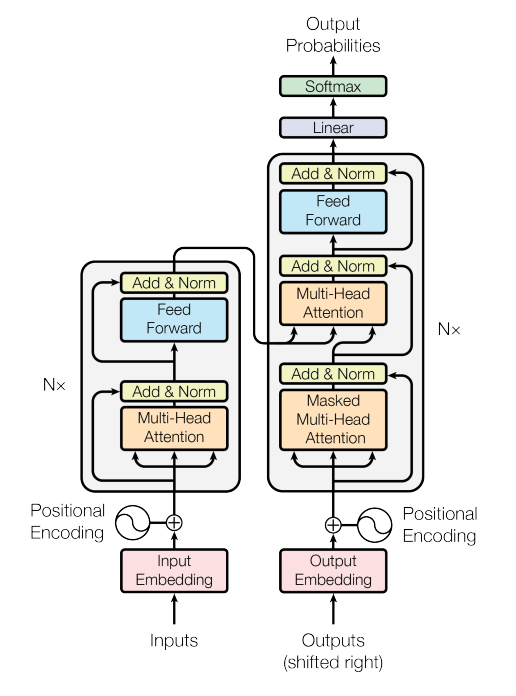
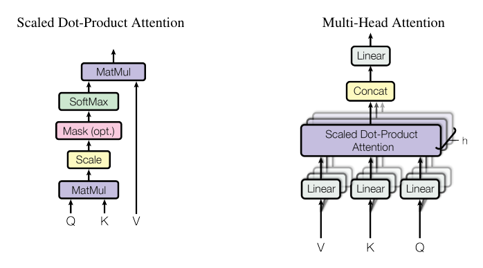
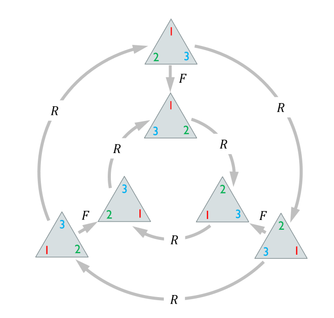
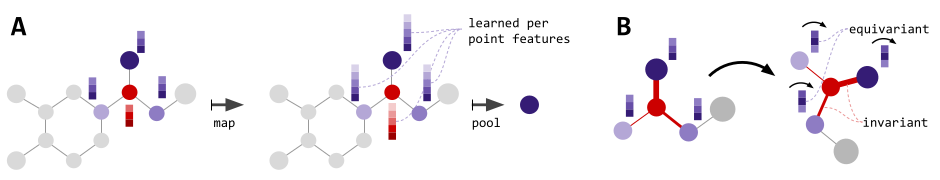
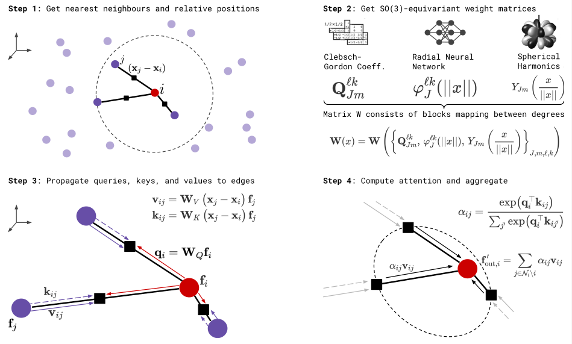

# Understanding the Attention Architecture

The goal of this note is to look into the history of attention architecture, its development, and how it is used in geometric deep learning
and other scientific fields where deep learning is used.

**Self Created, assisted with Generative AI, *only for markdown/LaTeX syntax, typos*.** (May contain errors)

## Reference Papers (Need to add site links since local links may be broken)
*The Refernce Index also serves as a table of contents in this note*

1. 
[Neural Machine Translation by Jointly Learning to Align and Translate](../Known/Paper/DeepLearningForMaterialsScience/FoundationalArchitectures/Attention/NeuralMachineTranslationByJointlyLearningToAlignAndTranslate.pdf)

2. 
[Attention Is All You Need](../Known/Paper/DeepLearningForMaterialsScience/FoundationalArchitectures/Attention/AttentionIsAllYouNeed.pdf)

3.
[Mathematical Foundations To Geometrical Deep Learning](../Known/Computation/MachineLearning/MathematicalFoundationsOfGeometricDeepLearning.pdf)

4.
[Geometric Deep Learning](../Known/Computation/MachineLearning/GeometricDeepLearning.pdf)

5.
[SE(3) Transformers](../Known/Paper/DeepLearningForMaterialsScience/SE3Transformers3dRotoTranslationEquivariantAttentionNetworks.pdf)

6.
[Graph Neural Network Architecture](../Known/Paper/DeepLearningForMaterialsScience/FoundationalArchitectures/TheGraphNeuralNetworkModel.pdf)

7.
[Directed Message Passing Neural Network](../Known/Paper/DeepLearningForMaterialsScience/FoundationalArchitectures/NeuralMessagePassingForQuantumChemistry.pdf)

### Neural Machine Translation by Jointly Learning to Align and Translate
*Soft Attentions as learned alignment (score $\to$ softmax $\to$ weighted sum)*

- **Introduction**

  Traditional Neural Machine Translation is enabled with an Encoder-Decoder per language.

  Encoder: Reads and encodes a source sentence into a fixed-length vector.
  Decoder: Outputs translation from the encoded vector.

  The problem with this architecture was that the neural network had to compress all information of a source
  sentence into a fixed-length vector; performance deterioration was rapid as the length of input sentences increased.

  This paper introduces an encoder-decoder model that learns to align and translate jointly, via soft searches for a set of positions
  in a source sentence, where information is concentrated (I believe this to be the soft-attention mechanism).

  This new method does not encode the whole input sentence into a single fixed-length vector; instead, it encodes the input sentence into a sequence of vectors, and chooses from these vectors a subset
  that is crucial for translation, adaptively whilst decoding the translation.

  The resultant improvement is apparent for longer sentences; this paper takes an example of the English-French Translation.
  The proposed model finds a linguistically plausible alignment between a source sentence (that is, to be encoded) and the corresponding target sentence.

- **Background: Neural Machine Translation**

  From a probabilistic perspective, translation is merely finding a target sentence $\mathbf{y}$ that maximizes the
  conditional probability of $\mathbf{y}$ given a source sentence $\mathbf{x}$, $\operatorname*{argmax}_{\mathbf{y}}p(\mathbf{y}|\mathbf{x})$.

  - RNN Encoder-Decoder
    
    The RNN Encoder-Decoder framework is proposed by Cho and Sutskever, 2014.

    The input sentence is read by the encoder as a sequence of vectors $\mathbf{x} = (x_1, \dots, x_{T_x})$ then transformed into a vector $\mathbf{c}$.

    Commonly, it is done through an RNN $\mathbf{h}_t$ such that

    $$
    \mathbf{h}_t = f(x_t, \mathbf{h}_{t-1})
    $$
    $$
    \mathbf{c} = q(\{\mathbf{h}_1, \dots, \mathbf{h}_{T_x}\})
    $$

    $\mathbf{h}_t$ is an $n$-dimensional vector of hidden state at time (or one should say token in this context) $t$, and $\mathbf{c}$ is a vector generated from the sequence of $\mathbf{h}_t$'s. $f$, $q$ are nonlinear functions. An [LSTM](../Known/Paper/DeepLearningForMaterialsScience/LongShortTermMemory.pdf)
    is also used as $f$ and $q$.

    The Decoder is often trained to predict the next word $y_{t'}$ (This must be where next-token-prediction comes in) given $\mathbf{c}$, and context vector and all previously predicted words
    $(y_1, \dots, y_{t'-1})$. The Decoder's job is to define a probability over the translation $\mathbf{y}$ by decomposing the joint probability into ordered conditional probabilities:

    $$
    p(\mathbf{y}) = \prod_{t=1}^{T} p(y_t | \{y_1, \dots, y_{t-1}\}, \mathbf{c})
    $$

    where $\mathbf{y} = (y_1, \dots, y_{T_y})$.

    Using an RNN (Recursive Neural Networks) means one will model each conditional probability as
    
    $$
    p(y_t | \{y_1, \dots, y_{t-1}\}, \mathbf{c}) = g(y_{t-1}, s_t, \mathbf{c})
    $$

    with $g$ a nonlinear, potentially multi-layered function outputting the probability of $y_t$, $s_t$ the hidden state of the
    RNN.

- **Learning to Align and Translate**

  This section proposes a novel architecture for neural machine translation. It consists of a bidirectional RNN as an encoder, and a decoder that emulates searching through a source sentence during decoding a translation.

  - General Description of the Decoder

    From the predefined conditional probability,
    $$
    p(y_i|y_1,\cdots,y_{i-1},\mathbf{x}) = g(y_{i-1}, s_i, c_i)
    $$
    $s_i$, the RNN hidden state for time (token) $i$ is computed with
    Cho et al. (2014a) and Sutskever et al. (2014):
    $$
    s_i=f(s_{i-1}, y_{i-1}, c_i)
    $$
    Unlike with
    $$
    p(\mathbf{y}) = \prod_{t=1}^{T} p(y_t | \{y_1, \dots, y_{t-1}\}, \mathbf{c})
    $$
    this architecture uses $c_i$, not $\mathbf{c}$, so a conditional vector dependent on each target word $y_i$.

    $c_i$ depends on a sequence of *annotations*, $(\mathbf{h}_1,\cdots,\mathbf{h}_{T_x})$, which is where an encoder maps the input sentence.
    Each $\mathbf{h}_i$ contains information of the whole input sequence with a strong focus on the parts surrounding the $i$-th word in the input sentences.
    The context vector $c_i$ is computed as a weighted linear combination of these annotations:
    $$
    c_i = \sum_{j=1}^{T_x}\alpha_{ij}\mathbf{h}_j
    $$
    And the weight $\alpha_{ij}$ is computed as
    $$
    \alpha_{ij} = \frac{\exp(e_{ij})}{\sum_{k=1}^{T_x}\exp(e_{ik})}
    $$
    (Strong Resemblance to the Boltzmann distribution, why many autrogressive generators have temperature parameters)
    $$
    e_{ij}=a(s_{i-1},\mathbf{h}_{j})
    $$
    $a$ is an *alignment model*, scoring how well the inputs around position $j$ and the output and position $i$ match.

    $a$ is parametrized as a feedforward NN, jointly trained with all other system components, unlike in traditional machine translations.
  
  - Bidirectional RNN for annotating sequence as the Encoder

    In order to inform the encoder the following, not only preceding words, bidirectional RNN is used.
    Composed of forward and backward RNNs, forward RNN $f$ reads the input sentences as is (from $x_1$ to $x_{T_x}$) and calculates
    forward hidden states, $(\overrightarrow{\mathbf{h}}_1,\cdots,\overrightarrow{\mathbf{h}}_{T_x})$. The backward RNN $b$ reads the sequence in reverse order (from $x_{T_x}$ to $x_1$), backward hidden states also in reverse order.

    Annotation for each word $x_j$ is created by concatenating $\overrightarrow{\mathbf{h}}_j$ and $\overleftarrow{\mathbf{h}}_j$, resulting in
    $$
    \mathbf{h}_j = [\overrightarrow{\mathbf{h}}_j^\top; \overleftarrow{\mathbf{h}}_j^\top]^\top
    $$
    $\mathbf{h}_j$ thus contains the summary of both preceding word and the following words. RNNs tend to better represent recent inputs; $\mathbf{h}_j$, as a result, is focused on the word around $x_j$.

- **Experiments**

  Two types of models are trained, the traditional RNN Encoder-Decoder and the proposed model, named RNNsearch; each are trained to support up to 30 and 50 words,
  with SGD and Adadelta optimization, 5 days (this paper was published in 2016, 10 yrs ago). Once the training is completed, a beam search is used to find a translation that
  approximately maximizes the conditional probability.

- **Results**

  I have skimmed through the Result section as NLP is not the main area of interest. The alignment matrix seems diagonal enough, though the translation result is quite interesting.

  **English Sentence:**
  An admitting privilege is the right of a doctor to admit a patient to a hospital or a medical centre to carry out a diagnosis or a procedure, based on his status as a health care worker at a hospital.

  **RNNencdec_50:**
  
  > Un privilège d'admission est le droit d'un médecin de reconnaître un patient à l'hôpital ou un centre médical d'un diagnostic ou de prendre un diagnostic en fonction de son état de santé.

  **RNNsearch:**
  
  > Un privilège d'admission est le droit d'un médecin d'admettre un patient à un hôpital ou un centre médical pour effectuer un diagnostic ou une procédure, selon son statut de travailleur des soins de santé à l'hôpital.

  (I should have paid closer attention in French class, but even I can tell the included detail, health care worker part that was omitted in RNNencdec, which makes sense as a readable sentence, though)

### Attention Is All You Need
*Introduction of the Transformer (Self-Attention) Architecture*
"Attention Is All You Need" is cited over 2M times, according to Google Scholar, making it one of the most cited papers in ML.

- **Introduction**
  RNNs, LSTMs, and Gated RNNs are considered SOTA in machine translation and language modeling. These recurrent models factor computation along the 'symbolic' positions of the input and output
  sequences. Positions are aligned to step $t$ in computation time, generating a sequence of hidden states $h_t$, which are a function of $h_{t-1}$ and input at $t$. The sequential nature precludes parallelization,
  which is critical for longer sequence lengths.

  Attention mechanisms are an integral part of compelling sequence modeling in various tasks. Attention enables modeling of dependencies without regard to the distance in input or output sequences, though in most cases, they are used in conjunction with an RNN.

  This work proposes the **Transformer** architecture which departs from recurrence and relies on an attention mechanism to draw global dependencies between input and output.
  
- **Model Architecture**

{ width=11cm fig-align=center latex-placement="H" }

  - Encoder Decoder Stacks
    The encoder is composed of a stack of $\mathcal{N}=6$ layers, each with two sub-layers. First, a multi-head self-attention mechanism; second, a simple position-wise fully connected feed-forward network.
    A residual connection around each of the two sub-layers is employed, followed by layer normalization.
    $$
    \text{LayerNorm}(x + \text{Sublayer}(x))
    $$
    (Note: The residual connection facilitates gradient flow, and LayerNorm stabilizes training.)
    $\text{Sublayer}(x)$ is the function implemented by the sub-layer itself. All sub-layers in the model, as well as the embedding layers, produce outputs of dimension $d_{\text{model}}=512$.
    (In simple words, the embedding is split, and one path goes through Multi-Head Attention or Feed-Forward, whilst the other bypasses and is added before LayerNorm).

    The Decoder is also composed of a stack of $\mathcal{N}=6$ layers. In addition to the two sub-layers present in each encoder layer, the decoder inserts a third sub-layer, which performs
    Multi-Head attention over the output of the entire encoder stack. Residual connections around each sub-layer, followed by layer normalization, are implemented likewise.

    The self-attention sub-layer in the decoder stack is masked to prevent positions from attending to subsequent positions. This masking, combined with the fact that the output embeddings are offset by one position, ensures that the
    prediction for position $i$ can depend only on the known outputs at positions less than $i$. (This ensures the auto-regressive property).

  - Attention

  {width=11cm fig-align=center latex-placement="H"}

  Attention is described as mapping a query and a set of key-value pairs to an output. The query, key, value and output are all vectors, where the output is computed as the
  weighted sum of values, with weights assigned to each value computed by a compatibility function of the query with the corresponding key.
  (Query and Key always come in pairs)
  - Scaled Dot-Product Attention
    The particular attention introduced is "Scaled Dot-Product Attention". The inputs are query ($Q$) and key ($K$) each with dimension $d_k$, and value ($V$) with dimension $d_v$.
    The dot product of $Q$ with $K$ is computed, each component is then divided by $\sqrt{d_{k}}$, then a softmax function is applied to obtain weights of $V$.
    In practice, the attention function on a set of queries is computed simultaneously, in a concatenated form of matrix $Q$. $K$ and $V$ are now also concatenated matrices $K$ and $V$.
    $$
    \text{Attention}(Q,K,V) = \text{softmax}\left(\frac{QK^T}{\sqrt{d_k}}\right)V
    $$
    In previous studies, the most commonly used attention functions were additive (which is similar to *Neural Machine Translation by Jointly Learning to Align and Translate*)
    and the Dot-Product Attention. The additive attention outperforms Dot-Product attention for high $d_k$, which is a result of large Softmax values pushing the gradient into small regions.
    Scaling by $\sqrt{d_k}$ is implemented to counteract the vanishing gradient problem.
    
  - Multi-Head Attention
    Linearly projecting $Q$, $K$, $V$ $h$ times with different learned linear projections to $d_k$, $d_k$ (where $d_k=d_q$), and $d_v$ dimensions respectively is beneficial over performing a single attention function.
    On the projected versions of $Q$, $K$, $V$, the attention function is performed in parallel, yielding $d_v$ dimensional outputs, which are again concatenated and projected.

    Multi-head attention allows the model to jointly attend to information from different representation subspaces at different positions.
    $$
    \text{MultiHead}(Q,K,V) = \text{Concat}(\text{head}_1,\cdots,\text{head}_h)W^O
    $$
    $$
    \text{head}_i = \text{Attention}(QW_i^Q,KW_i^K,V_i^V)
    $$
    The projection matrices would then take dimension
    $W_i^Q\in\mathbb{R}^{d_{model}\times d_k}, W_i^K\in\mathbb{R}^{d_{model}\times d_k}, W_i^V\in\mathbb{R}^{d_{model}\times d_v}, W^O\in\mathbb{R}^{hd_v\times d_{model}}$

    This paper uses $h=8$ parallel attention heads, $d_k=d_v=d_{model}/h=64$.
  - Applications of Attention
    1. In previous encoder-decoder attention layers, the queries come from the previous decoder layer, and the memory keys and values come from the output of the encoder. All positions in the decoder attend over all positions in the input sequences.
    2. The encoder contains self-attention layers, where all of the keys, values and queries are from the same place. Each position in the encoder can attend to all positions in the previous layer of the encoder.
    3. Likewise, self-attention layers in the decoder allow each position to attend to all positions in the decoder, including the 'self' position.
    To ensure only rightward information flow, for the auto-regressive property, scaled dot-product attention is masked to $-\infty$ where all values in the input of the softmax correspond to illegal connections.
  - Position-wise FFN
    Each layer in the Encoder and Decoder contains a fully connected feed-forward network, applied to each position separately and identically. $d_{model}=512, d_{ffn}=2048$. The FFN uses a well-known affine transformation with ReLU:
    $$
    \text{FFN}(x) = \max(0,xW_1+b_1)W_2+b_2
    $$
  - Embeddings and Softmax
    Learned Embeddings for token to vector conversion, learned linear transformation, and softmax functions are used. The same weight matrix between two embedding layers and pre-softmax transformation is used.
    In the embedding layers, the weights are multiplied by $\sqrt{d_{model}}$.
  - Positional Encoding
    Since the model contains no recurrence and convolution, relative or absolute position information of the token is required for the model to use the order of the sequence.
    Position Encoding (PE) is used with the dimension of the embedding:
    $$
      PE_{(pos,2i)} = \sin(pos/10000^{2i/d_{model}}),
    $$
    $$
      PE_{(pos,2i+1)} = \cos(pos/10000^{2i/d_{model}})
    $$
    With $i$ as the dimension.
    (In section 3, the only thing I understood was the attention function, which probably means I didn't understand anything, including the attention function itself.)    

- **Why Self-Attention?**

### Mathematical Foundations of Geometric Deep Learning
*My Group Theory Knowledge is limited to undergraduate Quantum Mechanics, Quantum Chemistry, especially its application to Condensed Matter Physics and molecular spectroscopy. I do not have any background in pure mathematics*

*This part of the note is mainly for understanding Geometric Deep Learning and its application, not its mathematical inquiries*

- Hypothesis Class
  Definition:
  If $\mathcal{X}$ is the input space and $\mathcal{Y}$ the label (output) space, the *hypothesis class* is any set
  $$
  \mathcal{F}\subseteq \{f: \mathcal{X}\rightarrow\mathcal{Y}\}
  $$
  of $f$ (hypothesis) from $\mathcal{X}$ to $\mathcal{Y}$ from which the learning algorithm chooses its prediction rule.

  For instance, linear regression's hypothesis is the set of all possible lines, or for the multi-dimensional case, a hyperplane. The hypothesis class of the
  Multi-Layer Perceptron would be... complex, which is why it works.

  In GDL, the hypothesis is greatly reduced with invariance and equivariance (symmetry), which is also related to the bias-variance trade-off.

- Groups
  are a set and its elements, with a binary operation, that are
  1. Associative
  $$
  \forall a,b,c \in \mathcal{G}, (a\cdot b)\cdot c = a\cdot (b\cdot c)
  $$
  Where $\mathcal{G}$ is the group and $\cdot$ is the binary operation
  2. Identity
  $$
  \exists ! e\in \mathcal{G} \text{ s.t. } \forall a\in\mathcal{G}, e\cdot a = a\cdot e = a
  $$
  3. Inverse
  $$
  \forall a \in \mathcal{G}, \exists ! b\in\mathcal{G} \text{ s.t. } a\cdot b = b\cdot a = e, b = a^{-1}
  $$

There are many examples of groups, from point groups and space groups of a crystal to... who knows how many.

{width=11cm fig-align=center latex-placement="H"}

 - Abelian groups are abelian. All the elements are commutative w.r.t. the group operation.
 - A subgroup is a subset of a group that happens to be a group.
 - The order of a group, denoted $|G|$, is the number of elements in the group.
In GDL, symmetry is important, and group theory is the language of symmetry.

- Homomorphism
  A *group homomorphism* is a map between two groups that preserves the group structure.
  Let $(G, \cdot)$ and $(H, *)$ be two groups. A map $\phi: G\rightarrow H$ is a *group homomorphism* if
  $$
  \forall a, b \in \mathcal{G}, \phi(a\cdot b) = \phi(a)*\phi(b)
  $$
  A *group isomorphism* is when a group homomorphism is bijective (1 to 1). Or when two same things are given different names.

  A group $C_4$ is isomorphic to the rotation of a square w.r.t. $\pi/2$ or multiplication by $i$ in the complex plane.

- A group action is, quite literally, how a group acts on a set, whilst preserving its group structure.
  A (left) *group action* of a group $\mathcal{G}$ on a set $X$ is a mapping
  $$
  \alpha: G\times X \rightarrow X, (g,x)\rightarrow\alpha(g,x) = g\cdot x
  $$
  That satisfies the identity and associativity conditions.

### Geometric Deep Learning

### SE(3)-Transformers: 3D Roto-Translation Equivariant Attention Networks
*Introduced the SE(3)-Transformer. It is a self-attention module (transformer), for 3D objects, and is equivariant under continuous 3D rotations*

{width=11cm fig-align=center latex-placement="H"}

- **Introduction**

  Point Cloud data is used throughout for many science-related fields like 3D molecular structures, N-body simulations, etc. It is almost obvious why
  we need an SE(3) symmetric layer for a deep neural network.

  This paper introduces self-attention as a pseudo-linear map between sets of points with two components:
  input-dependent attention weights and the embedding, called the value embedding.

  In the SE(3)-Transformer, the attention weights are invariant and the value embedding is equivariant to global position. (Is dependent only on relative coordinates).
  This restricts the space of learnable functions to a subspace which matches the symmetry of the object, not the symmetry of space (SE(3)) itself.

- **Background and relevant work**

  - The Attention Mechanism
    
    The standard attention mechanism is composed of Q, K, V, as is well known.
    $\mathbf{q}_i\in\mathbb{R}^p \text{ for } i=1,\dots,m$, $\mathbf{v}_i\in\mathbb{R}^r \text{ for } i=1,\dots,n$, $\mathbf{k}_i\in\mathbb{R}^p \text{ for } i=1,\dots,n$.
    $r, p$ are the dimensions of the projection - lower dimensional embedding. (I'm thinking this is the description of multi-head attention)

    When a query $\mathbf{q}_i$ is given, the attention mechanism is written as
    $$
    \text{Attn}(\mathbf{q}_i, \{\mathbf{k}_j\}, \{\mathbf{v}_j\})= \sum_{j=1}^{n}\alpha_{ij}\mathbf{v}_j
    $$
    $$
    \alpha_{ij} = \frac{\exp(\mathbf{q}_i^T\mathbf{k}_j)}{\sum_{j'=1}^n \exp(\mathbf{q}_i^T\mathbf{k}_{j'})}
    $$
    As we know (From Attention Is All You Need), softmax acts as a dot-product whilst being a nonlinearity acting on the weights.

    The "Self" aspect of the self-attention comes from the fact that q, k, v are the embeddings of the input features,
    $\mathbf{q}=h_Q(\mathbf{f}),\quad\mathbf{k}=h_K(\mathbf{f}),\quad\mathbf{v}=h_V(\mathbf{f})$ where $h$ is the neural network itself. (The embeddings, representations are learned).
    When the query $\mathbf{q}_i$ is associated with $i$ in the input, which has a location of $\mathbf{x}_i$, and if we have $n$ possible queries, the node $i$ attends to all other nodes except itself.

  - Permutation Equivariance
    
    The self-attention already has some form of symmetry, that is, permutation equivariance. The attention output does not depend arbitrarily on input point ordering. SE(3)-Transformer, of course, inherits this symmetry.

  - Graph Neural Networks
    
    Instead of attending with a full connection, it is better to introduce neighborhoods via a graph. Attentions have been
    integrated to the graph structure under the name of intra, self, vertex, graph-attention with the simple(?) form of
    $$
    \mathbf{y}_i = \frac{1}{\mathcal{C}(\{\mathbf{f}_j\}\in\mathcal{N}_i)}\sum_{j\in\mathcal{N}_i}w(\mathbf{f}_i,\mathbf{f}_j)h(\mathbf{f}_j)
    $$
    $\mathcal{C}$ acts as a normalizer working on $w,h$, the neural network itself. It has a similar structure to attention - claims the paper, but I don't see any...

  - Equivariance
    
    There is a lot written in this section, but essentially, it is saying that for an object $O$ and a neural network $h$, the group is equivariant w.r.t. the operation $S$ iff
    $$
    S h O = h S O \quad [S,h]=0
    $$ 
    This is familiar from QM class, and the paper gives an example of a Tensor Field Network, $\phi$.

  - Group Representations
    
    Group representations is a concept that I'm familiar with from quantum chemistry class, though details are forgotten. Essentially, the transformations acting upon the objects can form a group, and the group
    representation is the matrix representation, or in mathematical terms, the mapping to the General Linear Group. $\rho: G\rightarrow GL(N)$, the map of $G$ to the set of $N\times N$ non-singular matrices, $GL(N)$.
    Without a doubt (I'm no mathematician) $\rho$ is a group homomorphism. In the SE(3) case, $G=SO(3)$.

    When the representation is orthogonal, they are decomposable, through similarity transformation, into a form of an *irrep*
    $$
    \rho(g)=\mathbf{Q}^T\left[\bigoplus_{l} \mathbf{D}_l(g)\right]\mathbf{Q}
    $$
    Now, $l$ should be something familiar from general chemistry class, the orbital angular momentum. The representation is now decomposed into a direct sum of irreps, that are $(2l+1)\times (2l+1)$ of dimension, (this is why $-l$ to $+l$ for $n$), aka the Wigner-D (Drehung) matrix. They are irreps of $SO(3)$.
    The $l=0$ is called type 0 vectors (the spherically symmetric s-orbital) and they are invariant under rotations. The type-1 vectors (p-orbital) rotate according to the 3D rotation matrices. (Last semester, I had to apply this for the final exam... but failed)

  - Tensor Field Networks

  {width=11cm fig-align=center latex-placement="H"}
    
    TFNs map point clouds to another point clouds under the constraint of SE(3)-equivariance, which is the group of 3D rotations and translations. For point clouds, the input is a vector field
    $\mathbf{f}:\mathbb{R}^3\rightarrow\mathbb{R}^d$ which takes the form of
    $$
    \mathbf{f}(\mathbf{x})=\sum_{j=1}^N\mathbf{f}_j\delta(\mathbf{x}-\mathbf{x}_j).
    $$
    The Delta function must be where the name "point" comes from. $\mathbf{f}_j$ are the point features, (presumably $d$ dimensional).
    Each $\mathbf{f}_j$ is the concatenation of different types (orbitals) where a subvector (sub-orbital) of type-$l$ is written $\mathbf{f}_j^l$.

    A TFN layer computes the convolution of a continuous-in-space learnable weight kernel $\mathbb{W}^{lk}: \mathbb{R}^3\rightarrow\mathbb{R}^{(2l+1)\times(2l+1)}$, which is the transformation of type-k features to type-l features. (huh...)
    The type $l$ output of the TFN layers at position $\mathbf{x}_i$ is
    $$
    \mathbf{f}_{out,i}^{l}=\sum_{k\geq 0}\int \mathbb{W}^{lk}(\mathbf{x}'-\mathbf{x}_i)\mathbf{f}^k_{in}(\mathbf{x'})d\mathbf{x}' = \sum_{k\geq 0}\sum_{j=1}^n\mathbb{W}^{lk}(\mathbf{x}_j-\mathbf{x}_i)\mathbf{f}_{in,j}^k
    $$
    Where the integral part is the learned projection (convolution) from $k$ to $l$ and $\mathbb{W}$ part on the right is the message from $j$th to $i$th node.

    This is also representable as a linear combination of other sorts, using the basis of $(\mathbb{W}_J^{lk})_{J=|k-l|}^{k+l}$. Now, the $J$ (resembling the total angular momentum symbol) coefficient is a learnable function $\phi_J^{lk}:\mathbb{R}_{\geq0}\rightarrow\mathbb{R}$ of the radius $||\mathbf{x}||$
    $$
    \mathbb{W}^{lk}(\mathbf{x}) = \sum_{J=|k-l|}^{|k+l|}\phi^{lk}_J(||\mathbf{x}||)\mathbb{W}_J^{lk}\mathbf{x}, \quad \mathbb{W}_J^{lk}(\mathbf{x}) = \sum_{m=-J}^{J}Y_{Jm}(x/||\mathbf{x}||)Q_{Jm}^{lk}
    $$
    $W_J^{lk}$ is formed by taking a linear combination of Clebsch-Gordan matrix $Q$. (This is not similar to addition of angular momentum. This IS addition of angular momentum with different symbols).
    $\mathbb{W}_J^{lk}(0)\neq0$ only when $k=l$ or $J=0$ (selection rule), $\mathbb{W}^{ll}$ is a type 0
    We can thus rewrite TFN layer as
    $$
    \mathbf{f}_{out,i}^{l} = w^{ll}\mathbf{f}^l_{in,i} +\sum_{k\geq 0}\sum_{j\neq i}^n\mathbb{W}^{lk}(\mathbf{x}_j-\mathbf{x}_i)\mathbf{f}^k_{in,j'}
    $$
    Where the left term is the self-interaction term. The convolutions are now formed as a message passing form, with are concats/aggregations from all nodes and feature type(orbital). They form a nonlocal graph operation where the weights are functions on edges and the features $\mathbf{f}_i$ are node features.
    The attention layer will unify the aspects of convolutions and gnn.

  - Method
    1. Neighbourhoods
    Given a point cloud $\mathbf{x_i},\mathbf{f}_i$, the collection of neighbourhoods centered on each point $i$ is introduced. They are computed with NN methods or predefined, ex with bond information for molecules.
    2. The SE(3)-Transformer
    It consists of three components.
      - Edge-wise attention weights $\alpha_{ij}$, constructed to be SE(3) invariant on each edge ij
      - Edge-wise SE(3)-equivariant value messages, which propagates information between the nodes likewise with the TFN convolution
      - Linear/attentive self-interaction layer (Self interaction layer is important because nodes tend to forget the self information with epochs, or so that i've heard)
        Attention is performed on a per-neighbourhood basis, and is as follows
        $$
        \mathbf{f}_{out,i}^l = \mathbb{W}_V^{ll}\mathbf{f}_{in,i}^l+\sum_{k\geq 0}\sum_{j\in\mathcal{N}_i}\alpha_{ij}\mathbb{W}_V^{lk}(\mathbf{x}_j-\mathbf{x}_i)\mathbf{f}_{in,j}^k
        $$
        Removing the attention weights $\alpha_{ij}$ gives TFN, removing $\mathbb{W}_V$ dependence on $\mathbf{x}_j-\mathbf{x}_i$ yields the conventional attention mechanism.
        In order for the total mechanism to be SE(3) invariant, $\alpha_{ij}$ should also be invariant. This is achieved via a normalized inner product between $\mathbf{q}_i$, at node $i$ and key vectors $\{\mathbf{k}_{ij}\}_{j\in\mathcal{N}_i}$ along each edge $ij$ in the neighbourhood $\mathcal{N}_i$, with
        $$
        \alpha_{ij}=\frac{exp(\mathbf{q}_i^T\mathbf{k}_{ij})}{\sum_{j'\in\mathcal{N}_i}exp(\mathbf{q}_i^T\mathbf{k}_{ij'})}, \quad \mathbf{q}_i = \oplus_{l\geq 0}\sum_{k\geq0}\mathbb{W}_Q^{lk}\mathbf{f}_{in,i}^k,\quad \mathbf{k}_{ij}=\oplus_{l\geq0}\sum_{k\geq0}\mathbb{W}_K^{lk}(\mathbf{x}_j-\mathbf{x}_i)\mathbf{f}_{in,j}^k
        $$
        $\oplus$ is the direct sum (vector-concat). $\mathbb{W}$ are of the TFN type.

        Compare with the attention is all you need funtion

        Why is $\alpha_{ij}$ invariant?
        o

